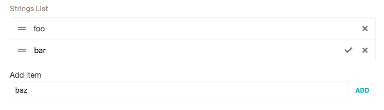
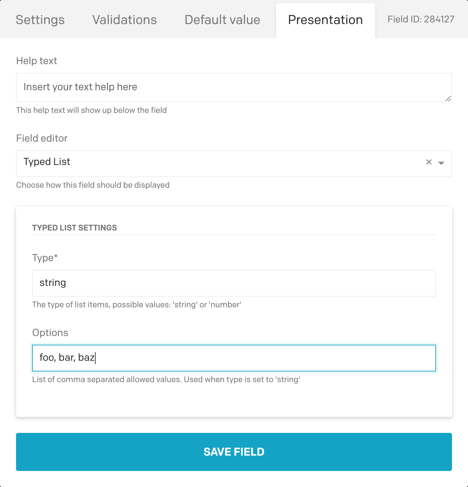
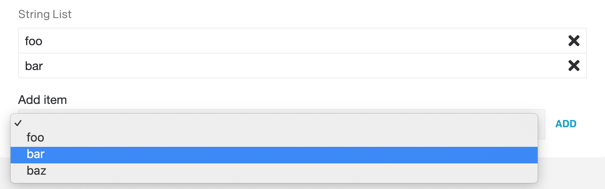

## Typed List field editor plugin for DatoCMS

This plugin transforms JSON fields of array type into editable lists.

When installing this plugin on a JSON field, you can configure two properties:

- `type`: defines the type of the array items. Possible values `string` and `number`. Default is `string`.
- `options`: when `type` is set to string, you can specify string of comma separated values allowed to be inserted into the array. This is done by replacing the regular text field to select dropdown. Note, this is not a validation rule but a user interface feature.

Example:

TODOs:
- convert to React
- add more types (color, url, etc.)
